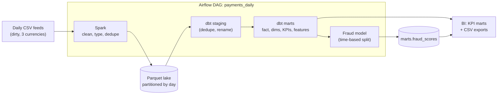
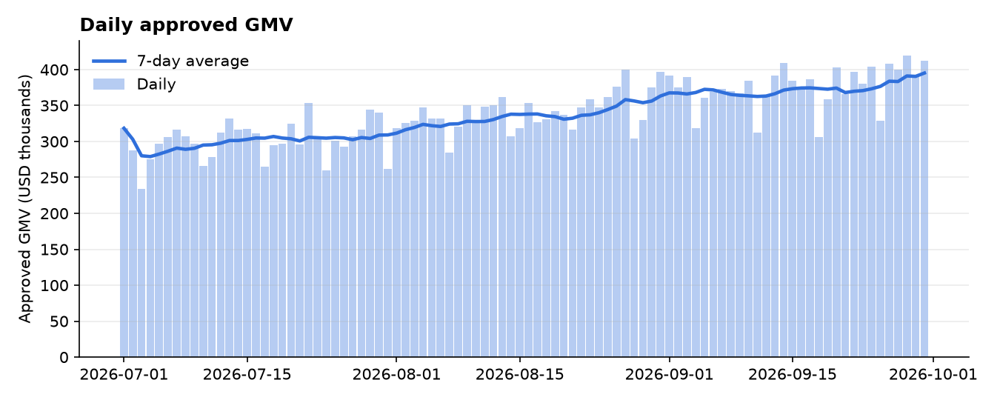
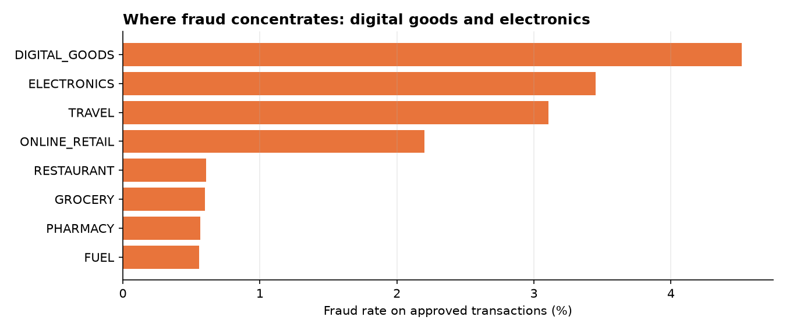
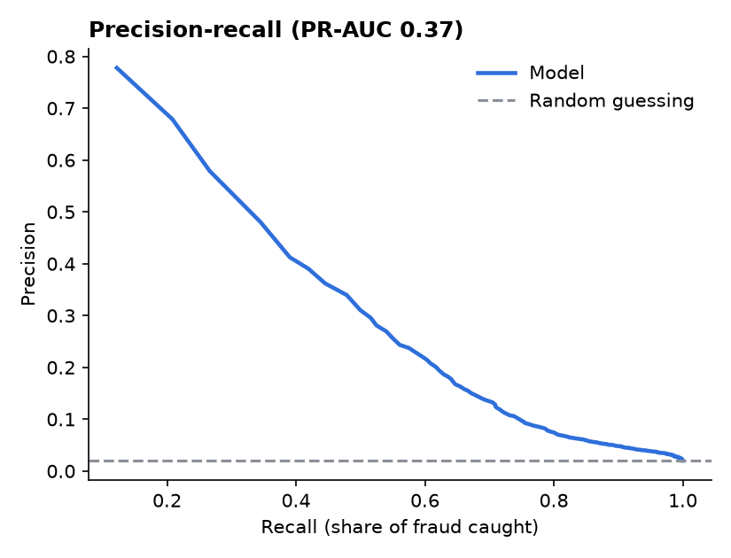
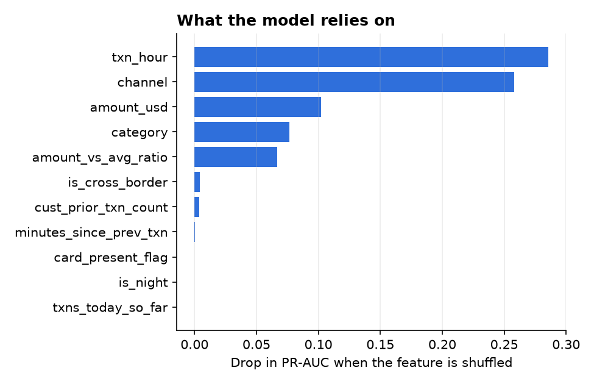
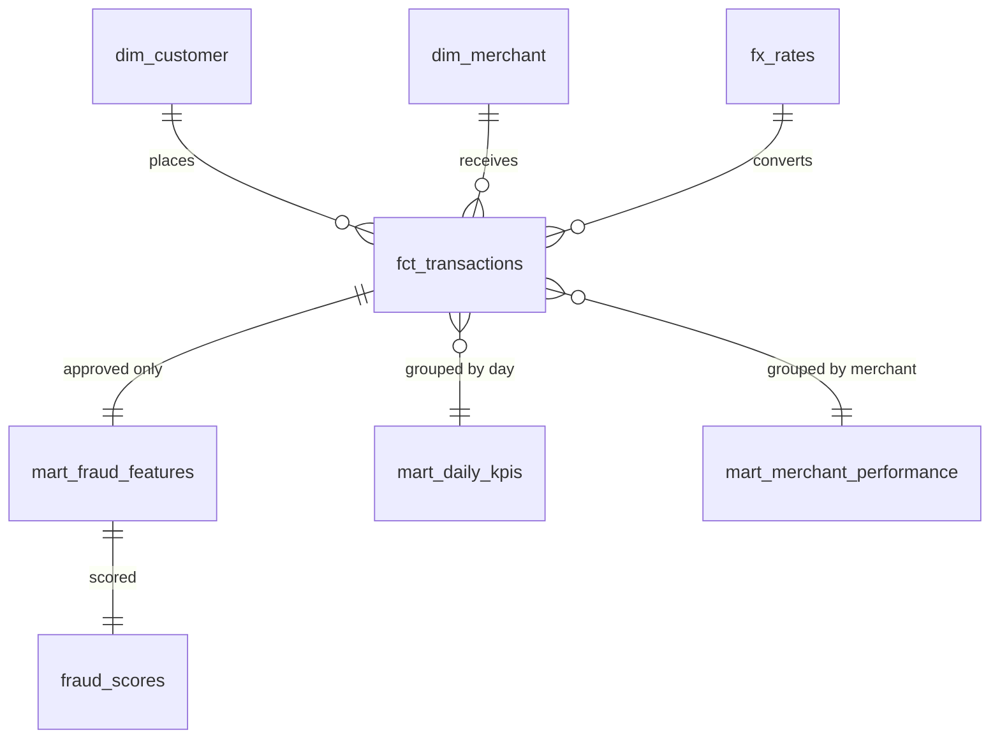

# Payments Analytics Pipeline

[](https://github.com/ShadiElmasry/payments-analytics-pipeline/actions/workflows/ci.yml)


An end-to-end **ELT and fraud-analytics pipeline** for a fintech payments business, built with
**Airflow, Spark, dbt, DuckDB/Snowflake and scikit-learn**. It takes messy daily transaction files from
raw CSV to tested KPI marts and a fraud model, with one command and no cloud account.

> **Data is synthetic.** It is generated by `src/payments/generate_data.py` (seeded, reproducible) with
> deliberately dirty rows and realistic fraud patterns. The model results below therefore show that the
> pipeline works, not how well fraud can be predicted in the real world.

## The business problem

A payments company receives millions of card transactions across Egypt, the UAE and Saudi Arabia, in three
currencies, from source systems that send duplicates, inconsistent text and missing amounts. Three teams need answers:

| Team | Question | Where the answer lives |
|---|---|---|
| Finance / management | How much did we process, and what is the approval rate? | `marts.mart_daily_kpis` |
| Merchant management | Which merchants drive volume and fraud exposure? | `marts.mart_merchant_performance` |
| Risk / fraud | Which approved transactions should analysts review first? | `marts.fraud_scores` |

## Architecture



| Layer | Tool | Responsibility |
|---|---|---|
| Orchestration | **Airflow** | Schedule, order, retry, alert. Contains no business logic. |
| Ingestion / cleaning | **PySpark 4** | Type casting, text normalisation, dedupe, partitioned Parquet |
| Transformation | **dbt** | Staging, fact and dimensions, KPI marts, ML features, 27 tests |
| Warehouse | **DuckDB** (default), **Snowflake** (experimental) | Storage and SQL compute |
| ML | **scikit-learn** | Fraud scoring, written back to the warehouse |
| Quality / CI | **pytest, ruff, GitHub Actions** | Unit tests, lint, full pipeline run on every push |

## Results

Run on 92 days of data: **318,617 raw rows, 316,046 after cleaning, $31.2M approved volume, 2.04% fraud rate.**




**Fraud model** (gradient boosting, trained on the first 70% of the timeline, evaluated on the last 30%):

| Metric | Value |
|---|---|
| ROC-AUC | 0.892 |
| PR-AUC | 0.367, against 0.020 for random guessing |
| Analysts review the top **1%** of transactions | catch **28%** of fraud cases and **56%** of fraud value (precision 56%) |
| Analysts review the top **5%** of transactions | catch **58%** of fraud cases and **81%** of fraud value (precision 23%) |

Fraud tends to be larger than normal spend, so a small review budget captures much more fraud *value* than fraud *count*.

<p>


</p>

## Quickstart

No credentials needed. Requires **Python 3.12 or 3.14** and **Java 17 or newer** (Spark 4 needs it).

```bash
git clone https://github.com/ShadiElmasry/payments-analytics-pipeline.git
cd payments-analytics-pipeline
python -m venv .venv && source .venv/bin/activate
make setup      # install dependencies
make demo       # generate data -> Spark -> dbt build + tests -> train model -> charts   (~2 min)
```

**Windows (PowerShell):** `make` is not available, so use the one-command runner instead. You need Python 3.12 or 3.14
and a Java 17+ JDK (`winget install Python.Python.3.14 EclipseAdoptium.Temurin.17.JDK`). Docker (below) avoids all of this.

```powershell
py -3.14 -m venv .venv; .venv\Scripts\Activate.ps1
pip install -r requirements.txt -r requirements-dev.txt
$env:PYTHONPATH = "$PWD\src"
python -m payments.run_all            # same five steps as `make demo`
```

Spark on native Windows may complain about `winutils.exe` when writing Parquet; if so, use Docker or WSL.

Other useful commands: `make test`, `make lint`, `make docs` (dbt lineage graph), `make help`.

### Run it with Docker (recommended on Windows)

Everything (Java, Spark, dbt, Airflow) lives inside the container, so nothing else needs installing except Docker Desktop.
The raw files, Parquet lake and DuckDB warehouse are kept in a Docker volume; charts, CSV exports and metrics appear in
your project folder (`docs/images/`, `exports/`, `reports/`).

```bash
docker compose build        # first time takes several minutes (downloads Spark)
```

**Option A: run the whole pipeline once (no Airflow UI)**

```bash
docker compose run --rm airflow bash -c "/home/airflow/venv/bin/python -m payments.run_all"
```

**Option B: run it under Airflow**

```bash
# 1. create the raw files (once)
docker compose run --rm airflow bash -c "/home/airflow/venv/bin/python -m payments.generate_data"
# 2. start Airflow
docker compose up
# 3. get the admin password (user: admin), in a second terminal
docker compose exec airflow cat /opt/airflow/standalone_admin_password.txt
```

Open http://localhost:8080, log in, unpause **payments_daily**, then process a few days like a real backfill:

```bash
docker compose exec airflow airflow dags backfill -s 2026-09-28 -e 2026-09-30 payments_daily
```

The DAG waits for each day's file, runs Spark, then `dbt seed`, `dbt run`, `dbt test`, trains the model and rebuilds the
report. If `dbt test` fails, the ML step never runs, so a model is never trained on bad data.

Notes:
- Run Option A **or** Option B at a time, not both together (DuckDB allows one writer).
- On Linux, run `export AIRFLOW_UID=$(id -u)` before `docker compose up` so files written to your folder are yours.
- Peek at the warehouse: `docker compose exec airflow /home/airflow/venv/bin/python -c "import duckdb; print(duckdb.connect('/data/warehouse.duckdb').sql('select * from marts.mart_daily_kpis limit 5'))"`
- Reset everything: `docker compose down -v` (deletes the data volume).

## Repository layout

```
dags/payments_daily.py        Airflow DAG: what runs, in which order, when
src/payments/
  generate_data.py            seeded synthetic data with realistic fraud patterns and dirty rows
  spark_clean.py              PySpark cleaning + partitioned Parquet (or Snowflake) sink
  train_fraud_model.py        time-split training, review-budget metrics, scores written back
  report.py                   charts for this README + CSV exports of the marts for BI tools
  run_all.py                  one-command runner (no make needed): works on Windows, Linux, macOS, Docker
dbt_project/
  models/staging/             stg_transactions, stg_customers, stg_merchants
  models/marts/               fct_transactions, dim_*, mart_daily_kpis, mart_merchant_performance,
                              mart_fraud_features
  macros/lake_table.sql       the one place that switches DuckDB <-> Snowflake
  tests/                      3 business-rule tests (+ 24 schema tests in models/schema.yml)
tests/                        pytest: data generator + Spark cleaning rules
.github/workflows/ci.yml      lint, unit tests, full pipeline on every push
warehouse/snowflake_setup.sql optional Snowflake objects
```

## Data model



## Data quality

`dbt build` runs **1 seed, 9 models and 27 tests** and fails loudly. Examples: unique and non-null keys,
accepted values for `status` and `channel`, foreign keys from the fact table to both dimensions,
every currency must have an FX rate, fraud may only appear on approved payments, approval rate must be between 0 and 1.

## Design decisions and trade-offs

- **Spark does cleaning, dbt does business logic.** Spark fixes what is wrong with the *files* (types, casing,
  bad rows). dbt owns what the *business* means (USD conversion, KPIs, features), where it is testable and documented in SQL.
- **Honest note on Spark:** at about 300k rows pandas or DuckDB alone would be faster. Spark is here to show the
  pattern (partitioned lake, idempotent per-day overwrites, a sink that can target Snowflake), and the same
  job would scale to far larger daily volumes without code changes.
- **DuckDB by default.** Anyone, including CI, can run the entire pipeline with zero setup. The SQL avoids
  engine-specific syntax (`dbt.datediff`, standard window functions) and a single macro switches the source.
- **Time-based split, not random.** A random split lets the model learn from the future and inflates scores.
  History features (`amount_vs_avg_ratio`, prior transaction count) only use *earlier* transactions.
- **Metrics a fraud team uses.** With about 2% fraud, accuracy is meaningless. The model is judged by PR-AUC and
  by what it catches inside a fixed analyst review budget, both by count and by value.
- **Idempotent re-runs.** Spark overwrites only the day it processes (dynamic partition overwrite); dbt keeps the newest
  copy of any transaction id, so re-running a day never double-counts.
- **Staging as tables.** DuckDB views over Parquet would store a file path; tables keep the project relocatable.

## Snowflake mode (experimental, not covered by CI)

The models are written to run on Snowflake as well. Create the objects with `warehouse/snowflake_setup.sql`,
copy `.env.example` to `.env`, then load raw data with Spark's Snowflake connector and build with dbt:

```bash
export DBT_TARGET=snowflake            # plus the SNOWFLAKE_* variables
# add the spark-snowflake + snowflake-jdbc jars that match your Spark/Scala version (Spark 4 = Scala 2.13)
python -m payments.spark_clean --all --sink snowflake
cd dbt_project && dbt build
```

Check that a Snowflake connector release supports your Spark version; if not, pin `pyspark<4` (Python 3.12 or older). The model training step currently reads from DuckDB only.

## Limitations and roadmap

- [ ] Incremental dbt models (currently full rebuild each run)
- [ ] Snowflake mode in CI and model training against Snowflake via Snowpark
- [ ] Power BI dashboard on top of the marts (CSV exports in `exports/` after `make report`)
- [ ] Model registry and drift monitoring; scheduled retraining DAG
- [ ] Streaming variant with Spark Structured Streaming

## Author

**Shady El Masry**, Data Analyst moving into analytics and data engineering.
[LinkedIn](https://www.linkedin.com/in/shady-elmasry1999) · [GitHub](https://github.com/ShadiElmasry)
